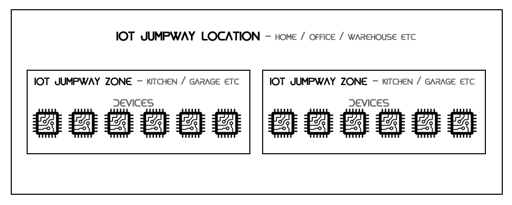
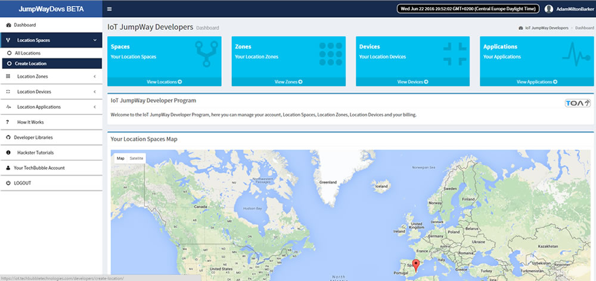
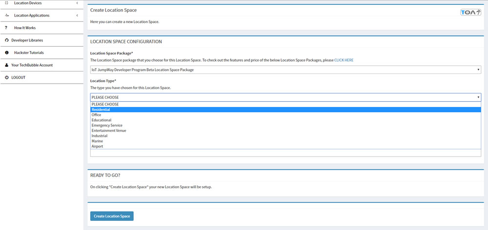

# IoT JumpWay Developer Program (BETA) Location Spaces

  

## Introduction

This document will describe the process of creating Location Spaces in the TechBubble Technologies IoT JumpWay Developer Program (BETA) GUI. 

  

To create an IoT network, a Location Space is required, each Location Space represents a physical location such as a home or office. A Location Space includes data storage and a set amount of messages. BETA testers can take advantage of the unique BETA Tier package which provides unrestricted data storage / cloud - device / device - cloud messages for the duration of the BETA period.  Further down the line you will find out how to assign Zones, Devices and Applications to the Location Spaces you have created.

## Location Spaces Guide

- The first step to do is to create your first IoT JumpWay Location Space. Once logged into the [TechBubble Technologies IoT JumpWay Developer Program (BETA) GUI](https://iot.techbubbletechnologies.com/developers/ "TechBubble Technologies IoT JumpWay Developer Program (BETA) GUI"), from the Developer Dashboard click on the "Location Spaces" button in the main menu on the left to toggle the drop down navigation, then click on the "Create Location" button.

  

- Once you have landed on the "Create Location" page, things should be fairly straight forward from here. Follow the instructions on the page and fill out all required fields then click on the "Create Location Space" button. If you have filled out all of the required fields you will be provided with your API Keys for the Applications REST API. At this point you should make a note of these and keep them safe, you will be able to reset these in the future but you will not be able to retrieve the ones issued in this stage of the setup.

  

## CONGRATULATIONS!!

You have now set up your first IoT JumpWay Location Space, to go through the next stage of setting up your IoT JumpWay Network, check out the Zones guide.