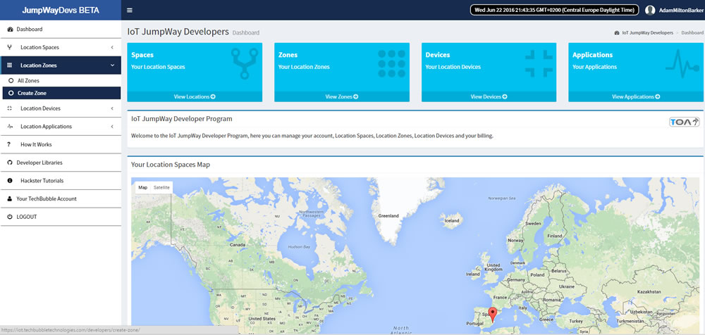
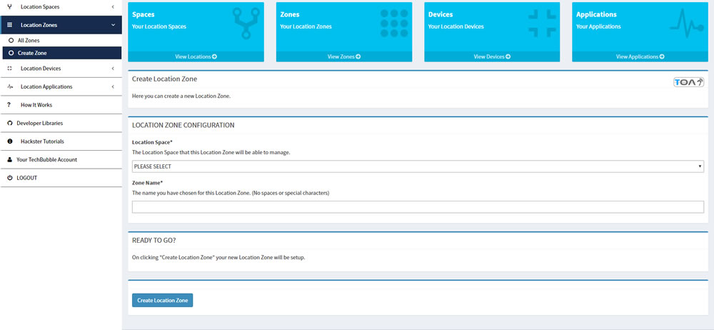

# IoT JumpWay Developer Program (BETA) Location Zones

  

## Introduction

This document will describe the process of creating Location Zones in the TechBubble Technologies IoT JumpWay Developer Program (BETA) GUI. 

  

 In the previous tutorial you learnt how to create your first Location Space which represents a physical location such as a home or office. Now we will take you through the short process of assigning Zones to the Location Space you just created.

 A Zone represents a zone within your Location Space. For example if your Location Space represented your home, you could make your first Location Zone your living room, dining room , kitchen or garden.

## Location Zones Guide

- In the left hand menu on the [TechBubble Technologies IoT JumpWay Developer Program (BETA) GUI](https://iot.techbubbletechnologies.com/developers/ "TechBubble Technologies IoT JumpWay Developer Program (BETA) GUI"), click on the "Location Zones" button to toggle the drop down navigation, then click on the "Create Zone" button.

  

- Once you have landed on the "Create Zone" page, things should be fairly straight forward from here. Follow the instructions on the page, select your Location Space that you wish to assign the Zone to, add a name for the Zone and click on the "Create Location Zone" button.

  

## CONGRATULATIONS!!

You have now set up your first IoT JumpWay Location Zone, to go through the next stage of setting up your IoT JumpWay Network, check out the Devices guide.