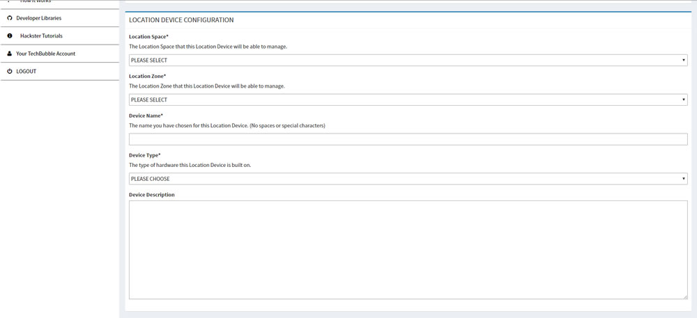
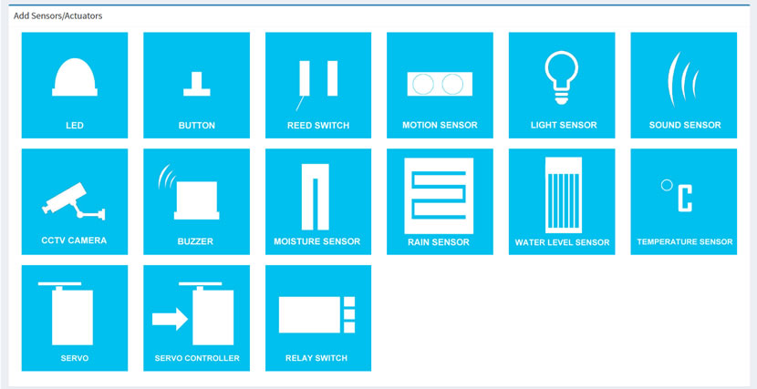

# IoT JumpWay Developer Program (BETA) Location Devices

  

## Introduction

This document will describe the process of creating Location Devices in the TechBubble Technologies IoT JumpWay Developer Program (BETA) GUI. 

  

 In the previous tutorial you learnt how to create your first Location Zone which represents a room or area within your Location Space (physical location such as a home or office). Now we will take you through the short process of assigning Devices to the Location Zone you just created.

 You can add unlimited Location Devices to your Zones.

## Location Devices Guide

- In the left hand menu on the [TechBubble Technologies IoT JumpWay Developer Program (BETA) GUI](https://iot.techbubbletechnologies.com/developers/ "TechBubble Technologies IoT JumpWay Developer Program (BETA) GUI"), click on the "Location Devices" button to toggle the drop down navigation, then click on the "Create Device" button.

  

- Once you have landed on the "Create Device" page you will see the first section which is the Location Device Configuration area. In this section we will select the "Location Space" and "Location Zone" that this device is to be attached to, enter a "Device Name", select a "Device Type" and finally add an optional "Device Description". Fill out this section then meet us in the next instructions below.

  

- At this point it is time to add sensors and actuators to your device. This step is required to provide you with sensor/actuator IDs for the "Publish To Device Sensors/Actuators", "Publish To Device Warnings" and "Subscribe To Device Commands" functions of the MQTT Library. This stage is very straight forward, simply click on the sensor/actuator that is included on your device and it will be attached once you submit your new device. If there is not a button available for your desired sensor or actuator please contact us so that we can add it. Once you have added your sensors and actuators, click on the "Create Location Device" button and make a note of the details provided to you as you will need them in the future tutorials on our Hackster/GitHub page.

  

## CONGRATULATIONS!!

You have now set up your first IoT JumpWay Location Device, there is only one more step to go, to go through the final stage of setting up your IoT JumpWay Network, check out the Location Applications guide. Make sure you have saved the credentials provided to you in this part of the process. You will learn how to use these in our Hackster/GitHub tutorials.