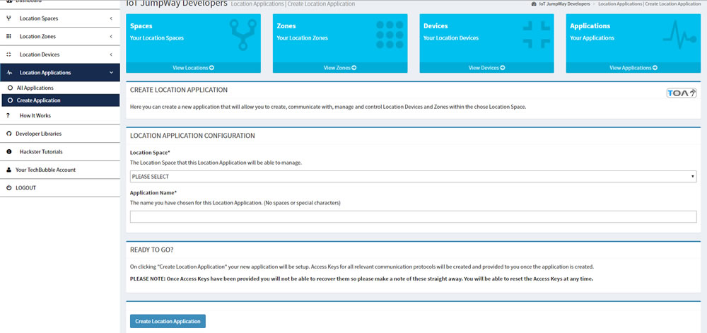

# IoT JumpWay Developer Program (BETA) Location Applications

  

## Introduction

This document will describe the process of creating Location Applications in the TechBubble Technologies IoT JumpWay Developer Program (BETA) GUI. 

  

 In the previous tutorial you learnt how to create your first Location Device. Now we will take you through the short process of setting up Application credentials that will allow you to manage your IoT Locations/Zones & Devices.

 An Application has the capabilities of subscribing to all devices attached to that specific Location Space. You can use Location Applications to manage and monitor your devices.

## Location Applications Guide

- In the left hand menu on the [TechBubble Technologies IoT JumpWay Developer Program (BETA) GUI](https://iot.techbubbletechnologies.com/developers/ "TechBubble Technologies IoT JumpWay Developer Program (BETA) GUI"), click on the "Location Applications" button to toggle the drop down navigation, then click on the "Create Application" button.

  

- Once you have landed on the "Create Applications" page, things should be fairly straight forward from here. Follow the instructions on the page, select your Location Space that you wish to assign the Application to, add a name for the Application and click on the "Create Location Application" button.

- You will be provided with API Keys and MQTT Credentials, you should make a note of these and keep them safe as you will need them for communicating with the IoT JumpWay.

## CONGRATULATIONS!!

You have now learnt the basics of Location Spaces, Location Zones, Location Devices and Location Applications! You are now ready to check out our guide on the TechBubble IoT JumpWay MQTT Client to find out how to connect your Devices and Applications to the IoT JumpWay to create your IoT Networks.